# ETH Agent Architecture

The ETH Agent is a modular, AI-powered system that combines multiple specialized agents with blockchain tools through the Model Context Protocol (MCP). The architecture follows a multi-layered approach with clear separation of concerns.

## System Overview

```mermaid
graph TB
    subgraph "User Interface"
        CLI["🤖 CLI REPL<br/>Interactive Terminal"]
    end
    
    subgraph "ETH Agent Core"
        Agent["EthAgent<br/>Main Orchestrator"]
        Planner["Planning Module<br/>Creates execution plans"]
        Executor["Execution Module<br/>Runs agent steps"]
        Evaluator["Evaluation Module<br/>Scores results"]
    end
    
    subgraph "AI Models"
        PlanModel["Planning Model<br/>Claude 3.5 Haiku"]
        ExecModel["Execution Model<br/>Claude 3.5 Haiku"]
        EvalModel["Evaluation Model<br/>Claude 3.5 Haiku"]
    end
    
    subgraph "Sub-Agents"
        EthAgent["Ethereum Agent<br/>Blockchain operations"]
        SearchAgent["Search Agent<br/>Web search"]
    end
    
    subgraph "MCP Integration"
        McpClient["FoundryMcpClient<br/>MCP Protocol Client"]
        McpServer["foundry-mcp<br/>MCP Server Process"]
    end
    
    subgraph "Tools & Services"
        EthTools["Ethereum Tools<br/>• balance<br/>• send_transaction<br/>• validate_address<br/>• get_contract_code<br/>• erc20_balance"]
        WebTool["Web Search Tool<br/>Brave Search API"]
    end
    
    subgraph "Blockchain Layer"
        Foundry["Foundry Provider<br/>Local/Remote RPC"]
        Network["Ethereum Network<br/>Mainnet/Testnet/Local"]
    end
    
    CLI --> Agent
    Agent --> Planner
    Agent --> Executor
    Agent --> Evaluator
    
    Planner --> PlanModel
    Executor --> ExecModel
    Evaluator --> EvalModel
    
    Executor --> EthAgent
    Executor --> SearchAgent
    
    EthAgent --> EthTools
    SearchAgent --> WebTool
    
    EthTools --> McpClient
    McpClient --> McpServer
    McpServer --> Foundry
    Foundry --> Network
    
    WebTool --> BraveAPI["Brave Search API"]
```

## Core Components

### 1. **ETH Agent Core (`agent.rs`)**
The main orchestrator that manages the entire execution lifecycle:
- **Planning**: Converts natural language prompts into structured execution plans
- **Execution**: Runs agent steps with specialized sub-agents
- **Evaluation**: Scores results against original intent with configurable thresholds
- **Error Handling**: Implements retry logic and replanning mechanisms

### 2. **Sub-Agent Architecture**
The system employs specialized agents for different domains:

- **Ethereum Agent**: Handles all blockchain operations using MCP tools
  - Transaction sending and validation
  - Balance queries (ETH and ERC20)
  - Smart contract interactions
  - Address validation

- **Search Agent**: Manages web search capabilities
  - Integrates with Brave Search API
  - Provides contextual information for decision making

### 3. **Model Context Protocol (MCP) Integration**
A key architectural decision that provides clean separation between AI logic and blockchain operations:

```mermaid
graph LR
    subgraph "MCP Architecture"
        direction TB
        
        subgraph "Agent Process"
            AgentCore["ETH Agent Core"]
            McpClient["FoundryMcpClient<br/>JSON-RPC over stdio"]
        end
        
        subgraph "MCP Server Process"
            McpServer["foundry-mcp binary<br/>Separate process"]
            FoundryService["FoundryService<br/>Tool implementations"]
        end
        
        subgraph "Blockchain Layer"
            FoundryProvider["Foundry Provider<br/>RPC connection"]
            EthNetwork["Ethereum Network"]
        end
        
        AgentCore --> McpClient
        McpClient <-->|"stdio<br/>JSON-RPC"| McpServer
        McpServer --> FoundryService
        FoundryService --> FoundryProvider
        FoundryProvider --> EthNetwork
    end
    
    subgraph "Available Tools"
        Tools["• balance(address)<br/>• send_transaction(from, to, value)<br/>• validate_address(address)<br/>• get_contract_code(address)<br/>• erc20_balance(address, token)"]
    end
    
    FoundryService -.-> Tools
```

**Benefits of MCP Architecture:**
- **Process Isolation**: Blockchain operations run in separate process
- **Protocol Standardization**: Uses standardized JSON-RPC communication
- **Tool Modularity**: Easy to add new blockchain tools
- **Error Isolation**: Foundry crashes don't affect the main agent
- **Resource Management**: Better memory and resource control

## Execution Flow

The system follows a structured execution pattern:

```mermaid
sequenceDiagram
    participant User
    participant CLI
    participant Agent
    participant Planner
    participant Executor
    participant EthAgent
    participant McpClient
    participant McpServer
    participant Foundry
    participant Evaluator
    
    User->>CLI: "Send 10 ETH from Alice to Bob"
    CLI->>Agent: UserPrompt
    
    Agent->>Planner: Create execution plan
    Planner->>Agent: AgentPlan with steps
    
    loop For each step
        Agent->>Executor: Execute step
        Executor->>EthAgent: Agent prompt + memory
        EthAgent->>McpClient: Tool call (send_transaction)
        McpClient->>McpServer: MCP request
        McpServer->>Foundry: Blockchain operation
        Foundry-->>McpServer: Result
        McpServer-->>McpClient: MCP response
        McpClient-->>EthAgent: Tool result
        EthAgent-->>Executor: Step result
        Executor-->>Agent: Step completion
        
        Agent->>Evaluator: Evaluate result
        Evaluator-->>Agent: Score & reasoning
        
        alt Score below threshold
            Agent->>Planner: Replan with error reason
        end
    end
    
    Agent-->>CLI: AgentResult
    CLI-->>User: "✅ Transaction sent successfully!"
```

## Key Architectural Patterns

### 1. **Multi-Model AI Strategy**
- **Planning Model**: Converts natural language to structured plans
- **Execution Model**: Handles tool usage and blockchain interactions  
- **Evaluation Model**: Scores results for quality assurance
- All models currently use Claude 3.5 Haiku for consistency

### 2. **Memory and Context Management**
- **Step Memory**: Each execution step builds upon previous results
- **Context Preservation**: User context maintained throughout execution
- **Error Context**: Failed steps provide context for replanning

### 3. **Tool-Based Architecture**
- **Rig Framework Integration**: Uses Rig for AI model interactions and tool definitions
- **Type-Safe Tools**: All tools have strongly-typed parameters and responses
- **Async Tool Execution**: Non-blocking tool operations

### 4. **Error Handling and Recovery**
- **Evaluation Thresholds**: Configurable quality gates (default: 70/100)
- **Automatic Replanning**: Failed steps trigger plan regeneration
- **Retry Logic**: Up to 3 planning attempts before failure
- **Graceful Degradation**: Partial results returned when possible

## Configuration and Extensibility

The system is designed for easy extension:

- **New Tools**: Add to `foundry-mcp/foundry_service.rs`
- **New Agents**: Implement in agent execution loop
- **New Models**: Configure different models for each phase
- **New Networks**: Modify Foundry provider configuration

## Security Considerations

- **Process Isolation**: MCP server runs in separate process
- **Parameter Validation**: All inputs validated before blockchain operations
- **Address Validation**: Ethereum addresses checked before transactions
- **Gas Limits**: Configurable limits prevent runaway transactions
